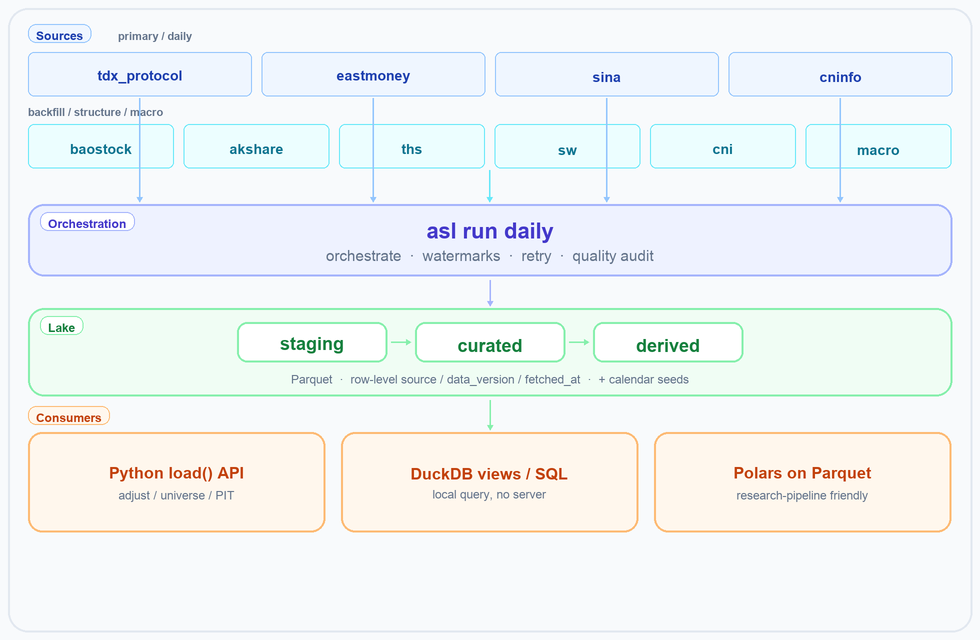

# A-Share Data Lake

[](https://github.com/rootSunc/ashare-lake/actions/workflows/ci.yml)
[](https://codecov.io/gh/rootSunc/ashare-lake)
[](https://pypi.org/project/ashare-lake/)
[](https://github.com/astral-sh/ruff)
[](https://www.python.org/downloads/)
[](LICENSE)

[中文](README.md)

A self-hosted A-share research lake: daily bars, adjust factors, fundamentals,
fund flow, sector structure, macro & sentiment — one contract, daily orchestration,
row-level provenance on curated Parquet.  
More than a fetch wrapper (watermarks / retry / audit); local vs cloud wide tables;
query with DuckDB / Polars / `load()` — no DB server, no TDX desktop client.

CLI: `asl` · package: `ashare_lake` · **data layer only** (backtests stay downstream).

- Real-data demo, not a toy mock
- Watermarks / retry / quality audit — cron-ready
- Row-level provenance: `source` / `data_version` / `fetched_at`
- One `load()` contract (adjust / universe / PIT)

<p align="center">
  
</p>

## Shortest path to data

The `pip` / `asl` commands below work on **macOS / Linux / Windows** (PowerShell
or cmd). Venv activation and schedulers differ by OS — see
[installation](docs/getting-started/installation.md) /
[runbook](docs/operations/runbook.md).

### A. Try it (minutes)

Five liquid names × ~30 trading days. Separate data root — **not** a full-market lake.

```bash
pip install ashare-lake
asl demo
```

<p align="center">
  
</p>

```python
from ashare_lake.query import load

bars = load("daily_bars", data_root="data/ashare-lake-demo", adjust="hfq")
```

```bash
asl query --config configs/ashare-lake.demo.toml --sql "
  SELECT symbol, trade_date, close, volume, source
  FROM daily_bars
  WHERE symbol = '600519.SH'
  ORDER BY trade_date DESC
  LIMIT 10
"
```

<p align="center">
  
</p>

If TDX is unreachable, try `asl servers test`. Optional:
`asl demo --symbols 600519.SH,000001.SZ --days 10`.

### B. Self-hosted daily lake (research / production)

First `asl init` backfills (slow, multi-GB). Afterwards: incremental + read.

```bash
pip install ashare-lake
# macOS / Linux:
asl config init --data-root /Users/you/ashare-lake
# Windows (forward or back slashes):
# asl config init --data-root D:/ashare-lake
# asl config init --data-root "D:\ashare-lake"
# macOS / Windows default workers=1; Linux example template uses 8
# Defaults to configs/ashare-lake.toml under cwd — --config usually omitted
asl init          # layout + first backfill
asl run daily     # every trading day afterwards
asl status
```

```python
from ashare_lake.query import load

bars = load(
    "daily_bars",
    start="2020-01-01", end="2025-12-31",
    adjust="hfq",              # None | "qfq" | "hfq"
    universe="all_a",
)
roe = load("financial_statement_items", items=["roe"], as_of="2024-04-30")
```

<p align="center">
  
</p>

```bash
asl query --sql "
  SELECT symbol, trade_date, adj_close
  FROM daily_bars_adj
  WHERE trade_date >= '2025-01-01'
"
```

> Path A uses `data/ashare-lake-demo/` + `configs/ashare-lake.demo.toml` (pass  
> `--config configs/ashare-lake.demo.toml` when querying).  
> Path B uses the default `configs/ashare-lake.toml` from `asl config init`.  
> The two lanes do not overwrite each other.

No extras: `pip install ashare-lake` brings every runtime source. After the
initial backfill, run the [acceptance checks](docs/operations/runbook.md)
before wiring a scheduler.

## Datasets

Dataset names are the first argument to `load()`. Columns:
[schema](docs/datasets/schema.md); orchestration metadata:
[catalog](docs/datasets/catalog.md).

| Category | Datasets |
|----------|----------|
| Reference | `instruments` · `trading_calendar` · `trading_status` (suspensions / ST) |
| Market data | `daily_bars` (unadjusted) · `index_bars` · `adj_factors` |
| Corporate events | `corporate_actions` · `announcement_index` · `earnings_disclosure_schedule` |
| Fundamentals / valuation | `financial_statement_items` (PIT) · `valuation_metrics` · `analyst_consensus` |
| Capital flow | `fund_flow` · `margin_trading` · `northbound_flows` / `northbound_holdings` · `dragon_tiger` · `block_trades` · `institutional_holdings` |
| Structure / industry | `sector_members` · `index_constituents` · `industry_members` |
| Macro | `macro_indicators` · `market_breadth` |
| Sentiment / rotation | `sentiment_scores` · `hot_rank` · `sector_bars` · `sector_fund_flow` · `news_headlines` |
| Risk | `share_unlock_schedule` · `regulatory_events` |

On-disk layout under path B's `data.root`:

```
{data_root}/
  curated/   {dataset}/{partition}=v/part-*.parquet
  derived/   adj_factors/...
  staging/   raw landing per run (cleanable after compact)
  meta/      manifest, quality findings, watermarks, on-demand cache
  duckdb/    ashare-lake.duckdb
```

## Positioning: peers

AkShare / efinance answer “how do I fetch?”; Tushare answers “cloud wide tables”;
Qlib / vn.py answer “research / trading platform”.
**ashare-lake** owns the middle layer: many sources into one contract, as a
resumable, provenance-tagged, auditable local Parquet lake.
Trade-offs: [comparison](docs/comparison.md) (Chinese).

| What you care about | **ashare-lake** | AkShare / efinance | Tushare Pro | Baostock | Qlib / vn.py |
|--|--|--|--|--|--|
| Local, resumable data base | **Lake + daily jobs** (watermarks / retry / audit) | In-memory fetch; you own orchestration | Cloud credits, not a self-hosted lake | Session fetch, no lake | Tied to platform data subsystem |
| Provenance / auditability | **Row-level provenance** + write-time schema checks | Usually no shared contract | Platform fields | No lake contract | Varies |
| Cross-source validation | **Primary curated + backup snapshots**, diffable, never silent replace | One call, one source | One vendor | One source | Varies |
| Stable research semantics | **`load()` contract**: adjust / universe / PIT `as_of` | DIY | DIY | DIY | Platform semantics |
| When a source fails | **Fail the batch**, surface it, retry by batch | Up to caller | Up to vendor | Up to caller | Varies |
| Standalone research data base? | **Yes** (lake + daily jobs + `load()`) | No — you still build landing/orchestration | Cloud tables, not self-hosted | No — session fetch | Yes, but platform-tied |


## Known limitations

- **Survivorship bias:** delisted names need `asl delisted backfill` + `repair`
  before trusting return series
- **Network:** some HTTP / sector backfills need mainland egress; demo needs TDX
- **Year/month partitions** (e.g. `index_bars`): prefer `asl query` / `load()` so
  hive labels do not collide with real dates — see
  [lake-layout](docs/architecture/lake-layout.md)

More: [runbook](docs/operations/runbook.md) ·
[troubleshooting](docs/operations/troubleshooting.md) ·
[legal](docs/legal-and-data-sources.md).

> Detailed getting-started docs are Chinese-first; this English README is the
> short path. See [docs/](docs/README.md) for the full index.

## Project status

[0.3.0](CHANGELOG.md) — published on [PyPI](https://pypi.org/project/ashare-lake/);
first public data-layer release the author runs on a personal daily cron.
Schema / `load()` may change before 1.0; see [CHANGELOG](CHANGELOG.md).

Personal project: issues and PRs welcome, responses best-effort.
[CONTRIBUTING](CONTRIBUTING.md) · [SECURITY](SECURITY.md). Docs are
Chinese-first; [CHANGELOG](CHANGELOG.md) and [ADRs](docs/adr/) stay in English.

## Docs

Full index: [docs/README.md](docs/README.md). Common entry points:
[installation](docs/getting-started/installation.md) ·
[quickstart](docs/getting-started/quickstart.md) ·
[catalog](docs/datasets/catalog.md) ·
[runbook](docs/operations/runbook.md) ·
[CLI](docs/reference/cli.md).

## License

Code is [MIT](LICENSE). Market data and announcements you land locally remain
subject to upstream terms; this repo ships no data and grants no redistribution
rights [legal](docs/legal-and-data-sources.md).
