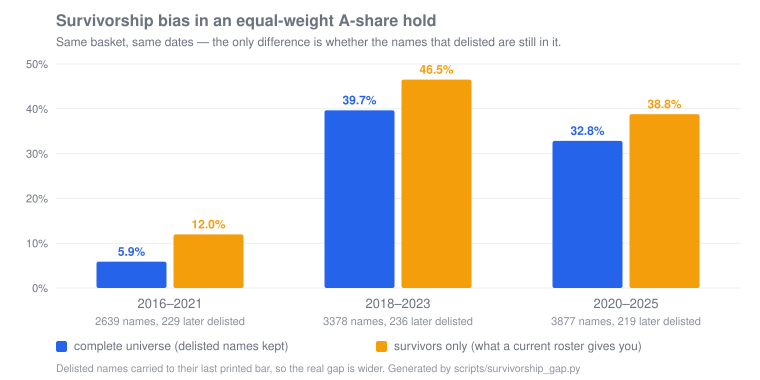

<h1 align="center">ASL</h1>
<p align="center"><b>A local, daily-refreshable A-share research lake</b></p>

<p align="center">
  <a href="https://github.com/rootSunc/ashare-lake/actions/workflows/ci.yml"></a>
  <a href="https://pypi.org/project/ashare-lake/"></a>
  <a href="https://www.python.org/downloads/"></a>
  <a href="LICENSE"></a>
  <a href="README.md"></a>
</p>

<p align="center">
  <b>Stop re-fetching and hand-rolling adjust factors.</b>
  One command drops a daily-refreshable A-share research lake onto your machine.<br>
  Fetch tools give you now; a lake gives you history.
</p>

<p align="center">
  <b>39 datasets · 9 categories</b> · <b>daily bars back to ~2001</b> ·
  <b>6 MCP tools</b> · <b>row-level provenance</b> ·
  <b>no tokens / no credits / no signup</b> · <b>MIT</b>
</p>

## Why a lake

<p align="center">
  
</p>

The same equal-weight buy-and-hold, the same dates. The only difference is
**whether names that later delisted are still in the basket**. Use "stocks that
exist today" as a historical universe — all a current-roster vendor can give
you — and the 2016–2021 five-year return goes from **5.9% to 12.0%**, twice
what it was.

The error **is not visible**: those names are not zero, they are absent.
Delisted names, adjustment factors, and PIT are first-class here — not a 40th
dataset on a coverage list.

```bash
python scripts/survivorship_gap.py --svg docs/assets/survivorship-gap.svg
```

## Data in ~30 seconds

```bash
pip install ashare-lake    # no source needs signup, tokens, or credits
asl demo                   # 5 names × 30 sessions, real adjustable daily bars
# optional: wire into Claude Code
claude mcp add ashare-lake -- asl mcp --config "$(pwd)/configs/ashare-lake.demo.toml"
```

Needs **TDX quote hosts** reachable (mainland egress is more reliable). If
down: `asl servers test`, or
`asl demo --symbols 600519.SH,000001.SZ --days 10`.

<p align="center">
  
</p>

```python
from ashare_lake.query import load

bars = load("daily_bars", data_root="data/ashare-lake-demo", adjust="hfq")
```

With MCP wired up, ask in plain language:

- "How much did Moutai return over the last five years, adjusted?"
- "Where does Moutai's PE sit in its own five-year distribution?" ★
- "This factor's IC in 2018 — no look-ahead." ★
- "What did the last 60 sessions look like for stocks that delisted?" ★

★ need a local history — a fetch-on-demand tool structurally cannot answer
them. **Fetch tools give you now; a lake gives you history.**

<p align="center">
  <a href="#what-you-can-ask-it">What you can ask</a> ·
  <a href="#why-not-just-akshare--tushare--a-fetch-skill">vs. the alternatives</a> ·
  <a href="#datasets">Datasets</a> ·
  <a href="#self-hosted-daily-lake">Self-hosted lake</a> ·
  <a href="#serve-it-to-an-ai-agent">AI agents</a> ·
  <a href="#glance-at-the-lake">Glance at the lake</a> ·
  <a href="#architecture">Architecture</a> ·
  <a href="#faq">FAQ</a>
</p>

## What you can ask it

| What you want to know | How you get it |
|--|--|
| Moutai five-year return, adjusted | `load("daily_bars", symbols=[...], adjust="hfq")` |
| ★ Moutai PE historical percentile | `valuation_metrics` + window percentile |
| ★ Factor IC in 2018, no look-ahead | `load("financial_statement_items", as_of="2018-04-30")` |
| ★ Last 60 sessions before delisting | `delisting_events` + `daily_bars` |
| ★ Equal-weight return, no survivorship bias | `scripts/survivorship_gap.py` (chart above) |
| Dragon-tiger / unlocks / sector flow | `dragon_tiger` · `share_unlock_schedule` · `sector_fund_flow` |
| ★ CSI 300 / Shenwan membership years ago | `index_constituents` · `industry_members` |

## Why not just AkShare / Tushare / a fetch skill

AkShare and agent fetch skills answer "how do I fetch?" — a snapshot of now,
with no history contract. Tushare is cloud wide tables. Qlib / vn.py are
research / trading platforms. **ASL** owns the middle: many sources, one
contract, a resumable local Parquet lake.

| What you care about | **ashare-lake** | AkShare / fetch skills | Tushare Pro | Qlib / vn.py |
|--|--|--|--|--|
| Local, resumable data base | **Lake + daily jobs** | On-demand; you own orchestration | Cloud credits | Platform-tied |
| Provenance | **Row-level** | Usually no shared contract | Platform fields | Varies |
| Research semantics | **`load()`: adjust / universe / PIT** | DIY | DIY | Platform |
| When a source fails | **Fail the batch**, retry by batch | Up to caller | Up to vendor | Varies |

Point by point: [comparison](docs/comparison.md).

## Datasets

**39** registered datasets (synced with `domain/datasets.py`). Columns:
[schema](docs/datasets/schema.md); orchestration:
[catalog](docs/datasets/catalog.md).

| Category | Datasets |
|----------|----------|
| Reference (3) | `instruments` · `trading_calendar` · `trading_status` |
| Market data (8) | `daily_bars` · `index_bars` · `minute_bars` / `5m` · `trade_ticks` · `commodity_bars` · `adj_factors` · `delisting_events` |
| Corporate events (3) | `corporate_actions` · `announcement_index` · `earnings_disclosure_schedule` |
| Fundamentals / valuation (3) | `financial_statement_items` · `valuation_metrics` · `analyst_consensus` |
| Capital flow (7) | `fund_flow` · `margin_trading` · `northbound_*` · `dragon_tiger` · `block_trades` · `institutional_holdings` |
| Structure / industry (4) | `sector_members` · `index_constituents` · `industry_members` · `industry_index` |
| Macro (3) | `macro_indicators` · `market_breadth` · `economic_calendar` |
| Sentiment / rotation (6) | `sentiment_scores` · `hot_rank` · `sector_bars` · `sector_fund_flow` · `news_headlines` · `flash_news_wire` |
| Risk (2) | `share_unlock_schedule` · `regulatory_events` |

Intraday (1m / 5m / ticks) is **off by default** — see
[runbook](docs/operations/runbook.md#日内数据minute_bars--minute_bars_5m).

## Self-hosted daily lake

```bash
pip install ashare-lake
asl config init --data-root /Users/you/ashare-lake   # Windows: D:/ashare-lake
asl init          # directories + first backfill (impatient? --profile quick = last 3 years, full cross-section)
asl run daily     # every trading day after that
asl status
```

```python
from ashare_lake.query import load

bars = load("daily_bars", start="2020-01-01", end="2025-12-31", adjust="hfq", universe="all_a")
roe = load("financial_statement_items", items=["roe"], as_of="2024-04-30")
```

The demo root (`data/ashare-lake-demo/`) and the daily lake do not overwrite each
other. Install and scheduling:
[installation](docs/getting-started/installation.md) ·
[runbook](docs/operations/runbook.md).

## Serve it to an AI agent

`asl mcp` exposes the lake to a model (read-only; ingestion stays on the CLI).

```bash
# You have a lake — full contract
claude mcp add ashare-lake -- asl mcp --config /abs/path/to/ashare-lake.toml

# No lake yet — run asl demo first, then point at the demo config
# No lake at all — add --live (no adjust / universe / PIT; responses say so)
```

`--config` must be an **absolute** path. Six tools by question shape (not one
per dataset); the contract travels in the responses. Details:
[MCP reference](docs/reference/mcp.md).

## Glance at the lake

Once the lake is up, `asl serve` shows coverage, freshness, and bytes by tier
(read-only — it never writes the lake):

```bash
asl serve     # http://127.0.0.1:8787
asl sources   # health of 14 upstream hosts (probe on CLI, display on serve)
```

<p align="center">
  
</p>

Details: [serve](docs/modules/serve.md) ·
[source-health](docs/operations/source-health.md).

## Architecture

Many sources into one pipeline, landed as staging → curated → derived, then
consumed with `load()` / DuckDB / Polars:

<p align="center">
  
</p>

More: [architecture overview](docs/architecture/overview.md).

## FAQ

**Q: How long does `asl init` take, and how much disk?**
A full backfill is hours and multiple GB. `asl init --profile quick` fetches
only the last three years — for the *full* cross-section. Filtering symbols
instead builds survivorship bias into the lake.

**Q: Why store only back-adjusted factors?**
Forward-adjusted prices move with "today". Disk stores hfq only; qfq is derived
in `load(adjust="qfq")`
([ADR-0004](docs/adr/0004-store-hfq-derive-qfq-at-query.md)).

**Q: EastMoney 403 / connection reset?**
Run `asl sources --only eastmoney_push2,eastmoney_push2his` first. Daily-path
bars come from TDX, outside that WAF blast radius.

**Q: Why can't I get minute bars from two years ago?**
The vendor keeps ~95 trading days of 1m and ~491 of 5m — vendor retention, not
this lake's backlog.

**Q: Can I redistribute the data commercially?**
Code is MIT. **Bars and filings on disk are not.** See
[legal](docs/legal-and-data-sources.md).

More: [troubleshooting](docs/operations/troubleshooting.md) ·
[runbook](docs/operations/runbook.md).

## Project status and docs

Personal project: issues and PRs welcome, responses best-effort.
[CONTRIBUTING](CONTRIBUTING.md) · [SECURITY](SECURITY.md) ·
[CHANGELOG](CHANGELOG.md).

Full index: [docs/README.md](docs/README.md). Common entry points:
[MCP](docs/reference/mcp.md) ·
[installation](docs/getting-started/installation.md) ·
[catalog](docs/datasets/catalog.md) ·
[CLI](docs/reference/cli.md).

Code is [MIT](LICENSE). Landed market data remains under upstream terms; this
repo ships no data lake and grants no redistribution rights.

---

If it saved you the work of building a data base layer, a ⭐ helps other A-share
researchers find it.
