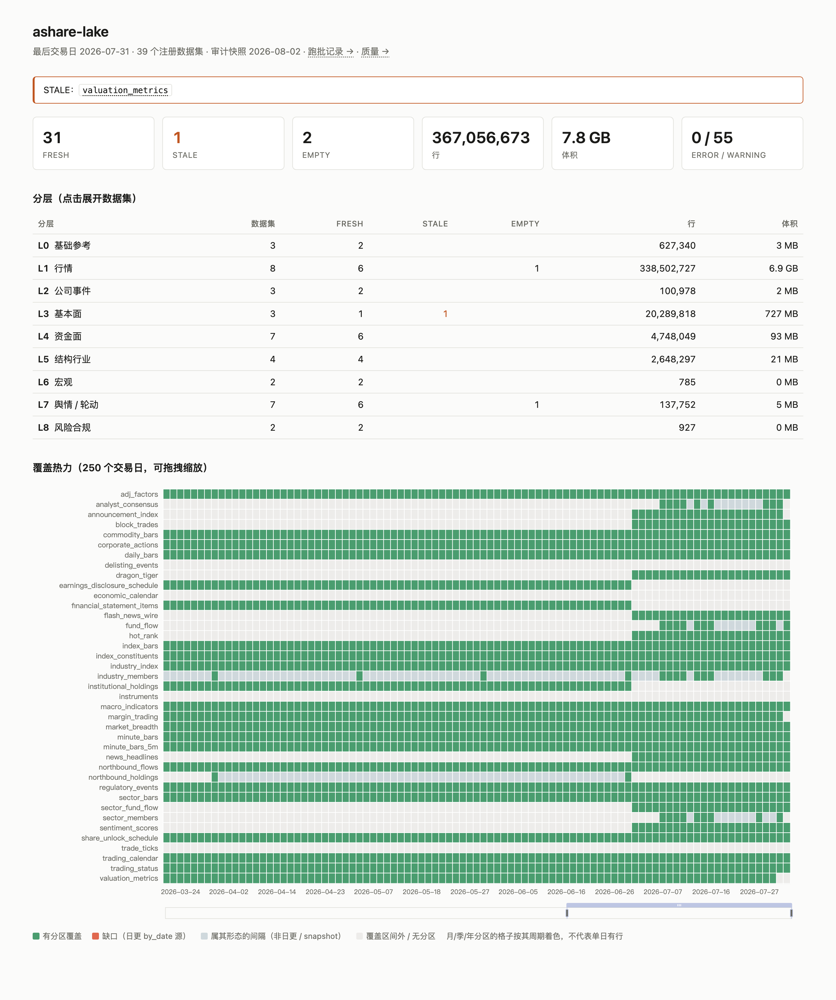
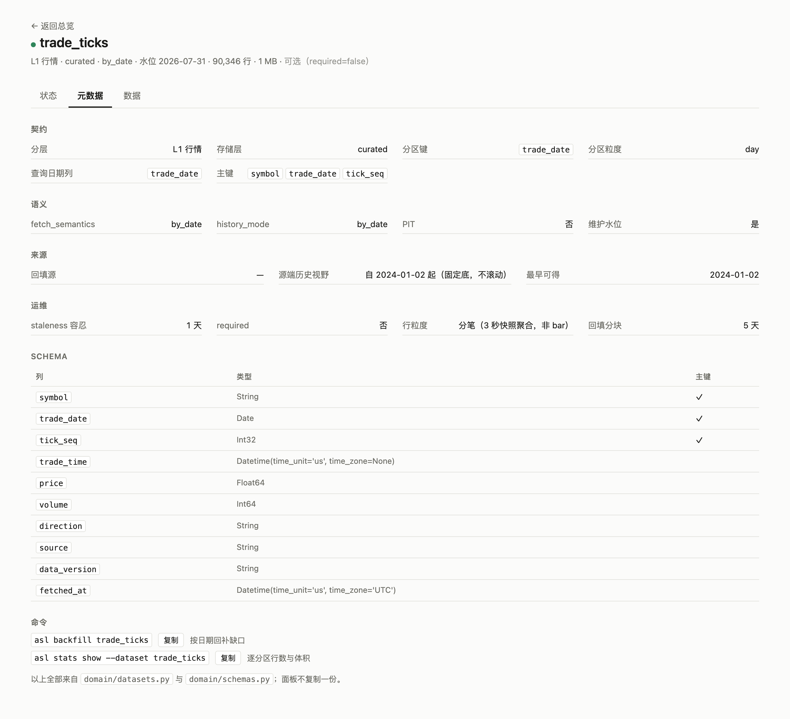

# A-Share Data Lake

[](https://github.com/rootSunc/ashare-lake/actions/workflows/ci.yml)
[](https://codecov.io/gh/rootSunc/ashare-lake)
[](https://pypi.org/project/ashare-lake/)
[](https://github.com/astral-sh/ruff)
[](https://www.python.org/downloads/)
[](LICENSE)

[中文](README.md)

**Stop re-fetching and hand-rolling adjust factors.** One install drops an
A-share research lake you can refresh automatically every trading day onto
local Parquet — many sources, one contract, row-level provenance, query with
DuckDB / Polars / `load()`.

- **Real data in minutes:** `pip install` → `asl demo` (not a mock)
- **Daily jobs that stay up:** watermarks / retry / audit; the author runs it
  every trading day
- **Stable research semantics:** adjust · universe · PIT; 39 registered datasets;
  daily bars back to ~2001

CLI: `asl` · package: `ashare_lake` · **data layer only** (backtests stay
downstream) · opt-in intraday data (1m / 5m bars, transaction records; all off
by default) · read-only dashboard `asl serve`

## Data in ~30 seconds

Needs reachability to **TDX quote hosts** (mainland egress is more reliable).
Five liquid names × ~30 trading days. Separate data root — **not** a
full-market lake. The demo lands daily bars only; everything else in the
catalog needs the self-hosted path below.

```bash
pip install ashare-lake
asl demo
# optional: asl demo --intraday   # also print one full 1m session
```

<p align="center">
  
</p>

```python
from ashare_lake.query import load

bars = load("daily_bars", data_root="data/ashare-lake-demo", adjust="hfq")
```

```bash
asl query --config configs/ashare-lake.demo.toml --sql "
  SELECT symbol, trade_date, close, volume, source
  FROM daily_bars
  WHERE symbol = '600519.SH'
  ORDER BY trade_date DESC
  LIMIT 10
"
```

<p align="center">
  
</p>

If TDX is down, try `asl servers test`. Or
`asl demo --symbols 600519.SH,000001.SZ --days 10`.

Commands work on macOS / Linux / Windows (PowerShell or cmd). Venv and
schedulers: [installation](docs/getting-started/installation.md) /
[runbook](docs/operations/runbook.md).

## Self-hosted daily lake

First `asl init` backfills (slow, multi-GB). Afterwards: incremental + read.
`load()` reads `data.root` from `configs/ashare-lake.toml` under the cwd by
default.

**No intraday data by default.** `asl init` / `asl run daily` cover the
daily / fundamentals path only; 1m / 5m bars and transaction records each need
enabling explicitly (next two subsections).

```bash
pip install ashare-lake
# macOS / Linux:
asl config init --data-root /Users/you/ashare-lake
# Windows: asl config init --data-root D:/ashare-lake
# macOS / Windows default workers=1; Linux example template uses 8
asl init          # layout + first backfill
asl run daily     # every trading day afterwards (no intraday data)
asl status
```

```python
from ashare_lake.query import load

bars = load(
    "daily_bars",
    start="2020-01-01", end="2025-12-31",
    adjust="hfq",              # None | "qfq" | "hfq"
    universe="all_a",
)
roe = load("financial_statement_items", items=["roe"], as_of="2024-04-30")
```

<p align="center">
  
</p>

```bash
asl query --sql "
  SELECT symbol, trade_date, adj_close
  FROM daily_bars_adj
  WHERE trade_date >= '2025-01-01'
"
```

> Demo lane: `data/ashare-lake-demo/` + `configs/ashare-lake.demo.toml` (pass
> that `--config` when querying).  
> Daily lane: `configs/ashare-lake.toml` from `asl config init`.  
> The two do not overwrite each other.

No extras: `pip install ashare-lake` brings every runtime source. After the
initial backfill, run the [acceptance checks](docs/operations/runbook.md)
before wiring a scheduler.

### Optional: minute bars (1m / 5m)

Off by default, and **not** part of plain `asl run daily` — full-market 1m is
~35MB/day and ~8.4GB/year. TDX keeps ~**95** trading days of 1m and ~**491** of
5m; older windows return nothing. Costs:
[runbook](docs/operations/runbook.md#日内数据minute_bars--minute_bars_5m).

In `configs/ashare-lake.toml`:

```toml
[minute_bars]
enabled = true
scope = "index:000300.SH"     # or watchlist / all
frequencies = ["1m", "5m"]    # 5m is the only frequency with real history
```

```bash
# One-off seed (resumable; --symbols pulls a few names without editing config)
asl backfill minute_bars_5m --start 2024-08-01 --end 2026-07-31
asl backfill minute_bars --start 2026-05-01 --symbols 600519.SH,000001.SZ

# Daily refresh: separate group, do not fold into default daily
asl run daily --group intraday
```

```python
from ashare_lake.query import load

m5 = load("minute_bars_5m", start="2026-07-01", symbols=["600519.SH"], adjust="hfq")
```

### Optional: transaction records (trade_ticks)

**Say the limitation first: these are not individual trades.** A-share Level-1
is a 3-second snapshot, so one TDX "分笔" record aggregates every trade in that
frame — measured, **6-33 real trades** on average, capping a session near 4,800
records. No order-by-order feed, no order book. The timestamp has **minute**
precision (the protocol never carried seconds), so a row is identified by
`tick_seq`, its position in the session, rather than by its time.

What it supports: buy/sell direction splits, large-order structure by
per-frame volume, 3-second resolution on the opening auction and the close.
What it does not: true tick reconstruction, order-flow imbalance, anything
needing the order queue.

Off by default, its own config block, on no schedule. The source reaches back
to **2024-01-02** — a fixed calendar floor that does not roll with today, so
the horizon grows. About 1.85 requests and 2,700 rows per symbol-session at
~8.4 bytes a row: a 200-name watchlist is roughly a minute and 4.5MB a day.

```toml
[trade_ticks]
enabled = true
scope = "watchlist"           # or index:<symbol>; "all" is refused
symbols = ["600519.SH", "000001.SZ"]
max_symbols = 200             # hard ceiling, checked before any request
```

```bash
asl backfill trade_ticks --symbols 600519.SH,000001.SZ --start 2026-07-01 --end 2026-07-31
asl run daily --group ticks   # daily refresh: again its own group
```

```python
ticks = load("trade_ticks", start="2026-07-20", symbols=["600519.SH"], adjust="hfq")
# direction: buy / sell / neutral / after_hours
# after_hours is 15:05-15:30 fixed-price trading and is NOT in the exchange's
# daily volume — exclude it before reconciling against daily_bars
```

Semantics, capacity and quality checks: [catalog](docs/datasets/catalog.md).
Compliance boundary: [legal and data sources](docs/legal-and-data-sources.md).

## Look at the lake: `asl serve`

A read-only dashboard. Coverage, freshness, source mix, audit findings and run
history live here; running, retrying and cleaning stay with the CLI.

```bash
asl serve                      # http://127.0.0.1:8787
asl serve --port 9000 --config configs/ashare-lake.toml
```

<p align="center">
  
</p>

The heatmap counts gaps in **each dataset's own period**, not in days — a
year-partitioned dataset is not reported as "missing 364 days" because one
directory covers the year.

A dataset opens into three tabs: **state** (coverage, gaps, provenance,
findings, recent batches), **metadata** (contract / schema / primary key /
horizon), **data** (real rows, with adjust and PIT controls).

<p align="center">
  
</p>

Everything on that tab comes from `domain/datasets.py` and
`domain/schemas.py` — the dashboard keeps no second copy of the contract,
because a second copy is a copy that drifts.

Binding to a non-loopback address requires `--token`. Details:
[serve module docs](docs/modules/serve.md).

## Architecture

<p align="center">
  
</p>

On-disk layout under the daily lake's `data.root`:

```
{data_root}/
  curated/   {dataset}/{partition}=v/part-*.parquet
  derived/   adj_factors/...
  staging/   raw landing per run (cleanable after compact)
  meta/      manifest, quality findings, watermarks, on-demand cache
  duckdb/    ashare-lake.duckdb
```

## Datasets

All **39** registered datasets (36 curated + 3 derived; kept in sync with
`domain/datasets.py`). Names are the first argument to `load()`. Columns:
[schema](docs/datasets/schema.md); orchestration:
[catalog](docs/datasets/catalog.md).

| Category | Datasets (`load()` name · meaning) |
|----------|-------------------------------------|
| Reference | `instruments` security master · `trading_calendar` trading calendar · `trading_status` suspensions / ST |
| Market data | `daily_bars` daily bars (unadjusted) · `index_bars` index bars · `minute_bars` 1m (opt-in) · `minute_bars_5m` 5m (opt-in) · `trade_ticks` transaction records (opt-in; 3-second snapshot aggregates, not tick-by-tick) · `commodity_bars` commodity main-continuous (opt-in) · `adj_factors` adjust factors (derived) · `delisting_events` delisting endings (derived) |
| Corporate events | `corporate_actions` corp actions (XDXR) · `announcement_index` announcement index · `earnings_disclosure_schedule` earnings disclosure timetable |
| Fundamentals / valuation | `financial_statement_items` financial statement items (PIT) · `valuation_metrics` valuation metrics · `analyst_consensus` analyst consensus |
| Capital flow | `fund_flow` stock fund flow · `margin_trading` margin trading · `northbound_flows` northbound flows · `northbound_holdings` northbound holdings · `dragon_tiger` dragon-tiger list · `block_trades` block trades · `institutional_holdings` institutional holdings |
| Structure / industry | `sector_members` sector members · `index_constituents` index constituents · `industry_members` industry membership · `industry_index` industry index (derived) |
| Macro | `macro_indicators` macro indicators · `market_breadth` market breadth · `economic_calendar` economic calendar (placeholder; source retired) |
| Sentiment / rotation | `sentiment_scores` sentiment scores · `hot_rank` popularity rank · `sector_bars` sector bars · `sector_fund_flow` sector fund flow · `news_headlines` news headlines · `flash_news_wire` 24/7 flash wire |
| Risk | `share_unlock_schedule` share unlock schedule · `regulatory_events` regulatory events |

**On-demand** (not on the curated daily path): `stock_news`, `research_reports`, etc. — see [catalog](docs/datasets/catalog.md).

## Positioning: peers

AkShare / efinance answer “how do I fetch?”; Tushare answers “cloud wide tables”;
Qlib / vn.py answer “research / trading platform”.
**ashare-lake** owns the middle layer: many sources into one contract, as a
resumable, provenance-tagged, auditable local Parquet lake.
Details: [comparison](docs/comparison.md) (Chinese).

| What you care about | **ashare-lake** | AkShare / efinance | Tushare Pro | Baostock | Qlib / vn.py |
|--|--|--|--|--|--|
| Local, resumable data base | **Lake + daily jobs** (watermarks / retry / audit) | In-memory fetch; you own orchestration | Cloud credits, not a self-hosted lake | Session fetch, no lake | Tied to platform data subsystem |
| Provenance / auditability | **Row-level provenance** + write-time schema checks | Usually no shared contract | Platform fields | No lake contract | Varies |
| Cross-source validation | **Primary curated + backup snapshots**, diffable, never silent replace | One call, one source | One vendor | One source | Varies |
| Stable research semantics | **`load()` contract**: adjust / universe / PIT `as_of` | DIY | DIY | DIY | Platform semantics |
| When a source fails | **Fail the batch**, surface it, retry by batch | Up to caller | Up to vendor | Up to caller | Varies |
| Standalone research data base? | **Yes** (lake + daily jobs + `load()`) | No — you still build landing/orchestration | Cloud tables, not self-hosted | No — session fetch | Yes, but platform-tied |

## Known limitations

- **Survivorship bias:** delisted names need `asl delisted backfill` + `repair`
  before trusting return series
- **Network:** some HTTP / sector backfills need mainland egress; demo needs TDX
- **Intraday horizon:** TDX keeps ~95 trading days of 1m and ~491 of 5m; older
  windows return nothing — see [catalog](docs/datasets/catalog.md)
- **Year/month partitions** (e.g. `index_bars`): prefer `asl query` / `load()` so
  hive labels do not collide with real dates — see
  [lake-layout](docs/architecture/lake-layout.md)

More: [runbook](docs/operations/runbook.md) ·
[troubleshooting](docs/operations/troubleshooting.md) ·
[legal](docs/legal-and-data-sources.md).

> Getting-started docs are Chinese-first; this English README is the short path.
> Full index: [docs/](docs/README.md).

## Project status

Personal project: issues and PRs welcome, responses best-effort.
[CONTRIBUTING](CONTRIBUTING.md) · [SECURITY](SECURITY.md). Docs are
Chinese-first; [CHANGELOG](CHANGELOG.md) and [ADRs](docs/adr/) stay in English.

## Docs

Full index: [docs/README.md](docs/README.md). Common entry points:
[installation](docs/getting-started/installation.md) ·
[quickstart](docs/getting-started/quickstart.md) ·
[catalog](docs/datasets/catalog.md) ·
[runbook](docs/operations/runbook.md) ·
[CLI](docs/reference/cli.md) ·
[serve dashboard](docs/modules/serve.md).

## License

Code is [MIT](LICENSE). Market data and announcements you land locally remain
subject to upstream terms; this repo ships no data and grants no redistribution
rights [legal](docs/legal-and-data-sources.md).
