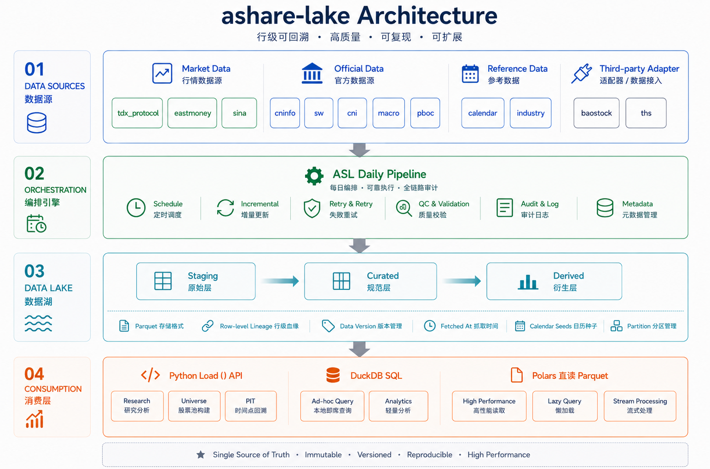

# A股数据湖

[](https://github.com/rootSunc/ashare-lake/actions/workflows/ci.yml)
[](https://codecov.io/gh/rootSunc/ashare-lake)
[](https://pypi.org/project/ashare-lake/)
[](https://github.com/astral-sh/ruff)
[](https://www.python.org/downloads/)
[](LICENSE)

[English](README.en.md)

**别再每次重拉、自己拼复权了。** 一行命令把能按天自动更新的 A 股研究湖落到本地 Parquet——多源进同一契约，行级可溯源。

- **真数上手**：`pip install` → `asl demo`，几分钟出可复权日线
- **日更能挂着跑**：水位 / 失败重试 / 质量审计；作者自用每天自动跑
- **研究口径一次定好**：复权 · universe · PIT；38 个注册数据集，日线可回溯到约 2001

CLI：`asl` · 包名：`ashare_lake` · **只做数据层**（回测和信号留给下游）· 可选分钟线（1m / 5m，默认关）

## 30 秒拿到真数

需要能访问 **TDX 行情主机**（大陆出口更稳）。5 只流动性股票 × 约 30 个交易日；独立目录，**不会**变成全市场湖。demo 只落日线——下面表里的其它数据集要走自建湖。

```bash
pip install ashare-lake
asl demo
# 可选：asl demo --intraday   # 再看一根完整 1m 会话
```

<p align="center">
  
</p>

```python
from ashare_lake.query import load

bars = load("daily_bars", data_root="data/ashare-lake-demo", adjust="hfq")
```

```bash
asl query --config configs/ashare-lake.demo.toml --sql "
  SELECT symbol, trade_date, close, volume, source
  FROM daily_bars
  WHERE symbol = '600519.SH'
  ORDER BY trade_date DESC
  LIMIT 10
"
```

<p align="center">
  
</p>

TDX 不通时先 `asl servers test`。也可 `asl demo --symbols 600519.SH,000001.SZ --days 10`。

macOS / Linux / Windows（PowerShell、cmd）命令通用；venv 与调度见 [installation](docs/getting-started/installation.md) / [runbook](docs/operations/runbook.md)。

## 自建日更湖

首次 `asl init` 会回填（耗时长、占磁盘）；之后日常增量 + 读取。`load()` 默认读 cwd 下 `configs/ashare-lake.toml` 的 `data.root`。

**默认不含分钟线。** `asl init` / `asl run daily` 只跑日频与基本面等主路径；1m / 5m 需显式开启（见下节）。

```bash
pip install ashare-lake
# macOS / Linux：
asl config init --data-root /Users/you/ashare-lake
# Windows：asl config init --data-root D:/ashare-lake
# macOS / Windows 默认 workers=1；Linux 示例模板为 8
asl init          # 建目录 + 首次回填
asl run daily     # 之后每个交易日（不含分钟线）
asl status
```

```python
from ashare_lake.query import load

bars = load(
    "daily_bars",
    start="2020-01-01", end="2025-12-31",
    adjust="hfq",              # None | "qfq" | "hfq"
    universe="all_a",
)
roe = load("financial_statement_items", items=["roe"], as_of="2024-04-30")
```

<p align="center">
  
</p>

```bash
asl query --sql "
  SELECT symbol, trade_date, adj_close
  FROM daily_bars_adj
  WHERE trade_date >= '2025-01-01'
"
```

> demo 线：`data/ashare-lake-demo/` + `configs/ashare-lake.demo.toml`（查数要带该 `--config`）。  
> 日更线：`asl config init` 写出的 `configs/ashare-lake.toml`。两条线互不覆盖。

无 extras：`pip install ashare-lake` 装齐运行时数据源。全量回填后建议按 [回填验收](docs/operations/runbook.md#回填完成验收) 再挂调度。

### 可选：分钟线（1m / 5m）

默认关闭，也**不在** `asl run daily` 里——全市场 1m 约 35MB/日、8.4GB/年。TDX 约只留 **95** 个交易日的 1m、**491** 个交易日的 5m；更早窗口为空，无法靠回填拉长。磁盘与耗时见 [runbook](docs/operations/runbook.md#日内数据minute_bars--minute_bars_5m)。

在 `configs/ashare-lake.toml` 里打开：

```toml
[minute_bars]
enabled = true
scope = "index:000300.SH"     # 或 watchlist / all
frequencies = ["1m", "5m"]    # 5m 是唯一有较长历史的频率
```

```bash
# 一次性种子（可续跑；--symbols 可只拉几只、不必改配置）
asl backfill minute_bars_5m --start 2024-08-01 --end 2026-07-31
asl backfill minute_bars --start 2026-05-01 --symbols 600519.SH,000001.SZ

# 日更：单独一组，不要塞进默认 daily
asl run daily --group intraday
```

```python
from ashare_lake.query import load

m5 = load("minute_bars_5m", start="2026-07-01", symbols=["600519.SH"], adjust="hfq")
```

## 架构

<p align="center">
  
</p>

落盘布局（日更湖的 `data.root` 下）：

```
{data_root}/
  curated/   {dataset}/{partition}=v/part-*.parquet
  derived/   adj_factors/...
  staging/   本次 run 原始落地（compact 后可清理）
  meta/      manifest、quality findings、水位、on-demand 缓存
  duckdb/    ashare-lake.duckdb
```

## 有什么数据

数据集名即 `load()` 的第一个参数。字段见 [schema](docs/datasets/schema.md)，编排见 [catalog](docs/datasets/catalog.md)。

| 类别 | 数据集 |
|------|--------|
| 基础参考 | `instruments` · `trading_calendar` · `trading_status`（停复牌 / ST） |
| 行情 | `daily_bars`（未复权） · `index_bars` · `adj_factors` · `minute_bars` / `minute_bars_5m`（可选日内） |
| 公司事件 | `corporate_actions` · `announcement_index` · `earnings_disclosure_schedule` |
| 基本面 / 估值 | `financial_statement_items`（PIT） · `valuation_metrics` · `analyst_consensus` |
| 资金面 | `fund_flow` · `margin_trading` · `northbound_flows` / `northbound_holdings` · `dragon_tiger` · `block_trades` · `institutional_holdings` |
| 结构 / 行业 | `sector_members` · `index_constituents` · `industry_members` |
| 宏观 | `macro_indicators` · `market_breadth` |
| 舆情 / 轮动 | `sentiment_scores` · `hot_rank` · `sector_bars` · `sector_fund_flow` · `news_headlines` |
| 风险 | `share_unlock_schedule` · `regulatory_events` |

## 定位：与同类差异

AkShare / efinance 解决「怎么拉数」；Tushare 解决「云端宽表」；Qlib / vn.py 解决「研究/交易平台」。  
**ashare-lake** 专做中间层：多源进同一契约，落成可日更、可溯源、可审计的本地 Parquet 湖。详见 [comparison](docs/comparison.md)。

| 你在意什么 | **ashare-lake** | AkShare / efinance | Tushare Pro | Baostock | Qlib / vn.py |
|--|--|--|--|--|--|
| 本地可续跑的数据底座 | **湖 + 日更编排**（水位 / 重试 / audit） | 只拉到内存，编排自管 | 云端积分，非自建湖 | 会话拉数，无湖 | 绑在平台数据子系统里 |
| 数据从哪来、能否复查 | **行级溯源** + 写前 schema 校验 | 通常无统一契约 | 平台字段 | 无湖契约 | 视模块 |
| 多源交叉核验 | **主源 curated + 备源 snapshot**，可 diff，不静默顶替 | 单次单源调用 | 单平台 | 单源 | 视配置 |
| 研究口径是否稳定 | **`load()` 契约**：复权组合 / universe / PIT `as_of` | 自己拼 | 自己拼 | 自己拼 | 平台口径 |
| 源挂了会怎样 | **fail batch**，暴露问题，可按批 retry | 看调用方 | 看平台 | 看调用方 | 视模块 |
| 能否单独当研究数据底座 | **能**（湖 + 日更 + `load()`） | 否，还需自建落盘/编排 | 云端表，非自建湖 | 否，会话拉数 | 能，但绑平台 |

## 已知限制

- **幸存者偏差**：退市股需 `asl delisted backfill` + `repair`；未补齐前收益序列要打折看
- **海外网络**：部分 HTTP / 板块回填依赖大陆出口；行情 demo 需 TDX 可达
- **日内视野**：TDX 约保留 95 个交易日的 1m、491 个交易日的 5m；更早窗口为空——见 [catalog](docs/datasets/catalog.md)
- **年/月分区**（如 `index_bars`）：优先 `asl query` / `load()`，避免 hive 分区标签撞真日期——见 [lake-layout](docs/architecture/lake-layout.md)

更多见 [runbook](docs/operations/runbook.md)、[排障](docs/operations/troubleshooting.md)、[legal](docs/legal-and-data-sources.md)。

## 项目状态

[0.4.0](CHANGELOG.md) — 当前主线；上 [PyPI](https://pypi.org/project/ashare-lake/) 后 `pip install -U ashare-lake`。作者自用数据层，每个交易日自动更新。Schema / `load()` 在 1.0 前可能变。

个人项目：issue / PR 欢迎，响应尽力而为。[贡献指南](CONTRIBUTING.md) · [安全策略](SECURITY.md)。文档中文为主；[CHANGELOG](CHANGELOG.md) 与 [ADR](docs/adr/) 为英文。

## 文档

完整索引：[docs/README.md](docs/README.md)。常用入口：[安装](docs/getting-started/installation.md) · [快速开始](docs/getting-started/quickstart.md) · [数据集目录](docs/datasets/catalog.md) · [Runbook](docs/operations/runbook.md) · [CLI](docs/reference/cli.md)。

## 许可

代码 [MIT](LICENSE)。落盘行情 / 公告仍受上游条款约束；仓库不附带数据湖，也不授予再分发权 [legal](docs/legal-and-data-sources.md)。
