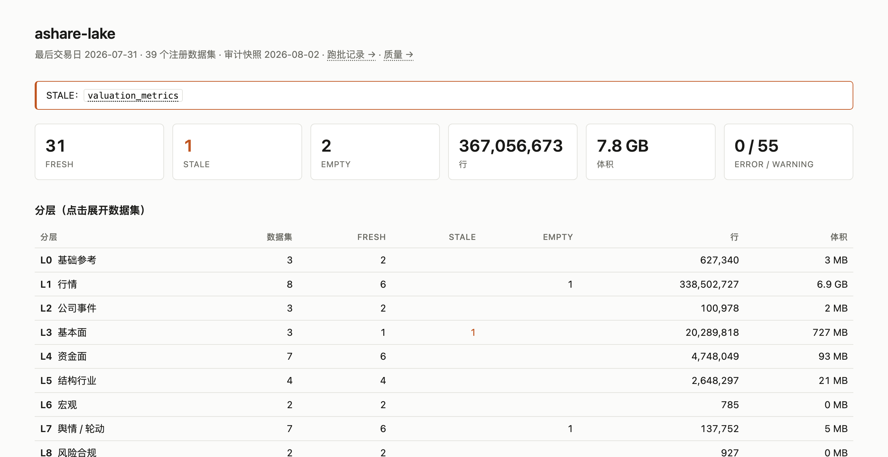

<h1 align="center">ASL · ashare-lake</h1>
<p align="center"><b>本地可日更的 A 股研究湖</b></p>

<p align="center">
  <a href="https://github.com/rootSunc/ashare-lake/actions/workflows/ci.yml"></a>
  <a href="https://pypi.org/project/ashare-lake/"></a>
  <a href="https://www.python.org/downloads/"></a>
  <a href="LICENSE"></a>
  <a href="README.en.md"></a>
</p>

<p align="center">
  <b>别再每次重拉、自己拼复权了。</b> 一行命令，把能日更的 A 股研究湖落到本地。<br>
  取数工具给你现在，湖给你历史。
</p>

<p align="center">
  <b>39 个数据集 · 9 大类</b> · <b>日线回溯约 2001</b> · <b>6 个 MCP 工具</b> · <b>行级溯源</b> · <b>零 token / 零积分 / 零注册</b>
</p>

## 为什么要一个湖

<p align="center">
  
</p>

同一个等权买入持有，同样的起止日期，唯一差别是**后来退市的票还在不在篮子里**。用「今天还在的股票」当历史股票池——几乎所有按当前名单发数的源只能给你这个——2016–2021 五年收益从 **5.9% 变成 12.0%**，虚高一倍。

这类错误**看不出来**：那些票不是零，是不在。退市股、复权因子、PIT 在这里是一等公民，不是覆盖面上的第 40 个数据集。

```bash
python scripts/survivorship_gap.py --lang zh --svg docs/assets/survivorship-gap.zh.svg
```

## 30 秒拿到真数

```bash
pip install ashare-lake    # 所有数据源都不要注册、token、积分
asl demo                   # 5 只票 × 30 个交易日，真实日线
```

实测 25 秒。需能访问 **TDX 行情主机**（大陆直连即可）。不通先 `asl sources --only tdx_protocol`。

<p align="center">
  
</p>

```python
from ashare_lake.query import load

bars = load("daily_bars", data_root="data/ashare-lake-demo")
```

## 建你自己的湖：四条命令

```bash
pip install ashare-lake
asl config init            # 写出 configs/ashare-lake.toml
asl init                   # 全市场标的 × 最近 3 年（约 1 小时）
asl run daily              # 之后每个交易日跑这一条
```

`asl init` 默认**浅而不窄**：年限少，标的一个不缺。按标的裁剪会把幸存者偏差直接建进湖里，
而浅是诚实的——`coverage_start` 会如实记录。想要全量历史：`asl init --profile full`（约 3 倍时间），
或随时加深：

```bash
asl backfill daily_bars --start 2016-01-01 --end <你的 coverage_start>
```

**接给 AI**（可选，湖建好之后）：

```bash
claude mcp add ashare-lake -- asl mcp --config "$(pwd)/configs/ashare-lake.toml"
```

接上 MCP 之后，直接用中文问：

- 「茅台过去五年复权后涨了多少？」
- 「茅台现在的 PE 在自己五年历史里处于什么分位？」★
- 「2018 年这个财报因子的 IC，别用未来数据。」★
- 「过去三年退市的票，退市前 60 天什么形态？」★

★ 需要本地历史序列——现拉现给的工具结构上答不了。**取数工具给你现在，湖给你历史。**

<p align="center">
  <a href="#能回答什么问题">能问什么</a> ·
  <a href="#为什么不是-akshare--tushare--取数-skill">与同类差异</a> ·
  <a href="#有什么数据">数据集</a> ·
  <a href="#自建日更湖">自建日更湖</a> ·
  <a href="#接给-ai-agent">接给 AI agent</a> ·
  <a href="#看一眼湖">看一眼湖</a> ·
  <a href="#架构">架构</a> ·
  <a href="#faq">FAQ</a>
</p>

## 能回答什么问题

| 你想知道 | 怎么拿 |
|--|--|
| 茅台过去五年复权后涨了多少 | `load("daily_bars", symbols=[...], adjust="hfq")` |
| ★ 茅台 PE 的历史分位数 | `valuation_metrics` + 窗口分位 |
| ★ 2018 年财报因子 IC，别用未来数据 | `load("financial_statement_items", as_of="2018-04-30")` |
| ★ 退市股退市前 60 天形态 | `delisting_events` + `daily_bars` |
| ★ 全市场等权收益，剔除幸存者偏差 | `scripts/survivorship_gap.py`（上面那张图） |
| 今天龙虎榜 / 未来解禁 / 板块资金流 | `dragon_tiger` · `share_unlock_schedule` · `sector_fund_flow` |
| ★ 三年前的沪深300成分 / 申万行业 | `index_constituents` · `industry_members` |

## 为什么不是 AkShare / Tushare / 取数 skill

AkShare / 取数 skill 解决「怎么拉数」——拿到的是没有历史口径的当下快照。Tushare 是云端宽表。Qlib / vn.py 是研究/交易平台。**ASL** 做中间层：多源进同一契约，落成可日更、可溯源的本地 Parquet 湖。

| 你在意什么 | **ashare-lake** | AkShare / 取数 skill | Tushare Pro | Qlib / vn.py |
|--|--|--|--|--|
| 本地可续跑的数据底座 | **湖 + 日更编排** | 现拉，编排自管 | 云端积分 | 绑在平台里 |
| 数据能否复查 | **行级溯源** | 通常无统一契约 | 平台字段 | 视模块 |
| 研究口径 | **`load()`：复权 / universe / PIT** | 自己拼 | 自己拼 | 平台口径 |
| 源挂了 | **fail batch**，可按批 retry | 看调用方 | 看平台 | 视模块 |

逐条展开：[comparison](docs/comparison.md)。

## 有什么数据

**39** 个注册数据集（与 `domain/datasets.py` 同步）。字段见 [schema](docs/datasets/schema.md)，编排见 [catalog](docs/datasets/catalog.md)。

| 类别 | 数据集（`load()` 名 · 中文） |
|------|------------------------------|
| 基础参考（3） | `instruments` 证券主数据 · `trading_calendar` 交易日历 · `trading_status` 交易状态（停复牌 / ST） |
| 行情（8） | `daily_bars` 日线 · `index_bars` 指数日线 · `minute_bars` 1 分钟线（可选） · `minute_bars_5m` 5 分钟线（可选） · `trade_ticks` 分笔（可选） · `commodity_bars` 商品期货主连（可选） · `adj_factors` 复权因子 · `delisting_events` 退市事件 |
| 公司事件（3） | `corporate_actions` 公司行为 · `announcement_index` 公告索引 · `earnings_disclosure_schedule` 业绩披露预约 |
| 基本面 / 估值（3） | `financial_statement_items` 财务报表科目 · `valuation_metrics` 估值指标 · `analyst_consensus` 分析师一致预期 |
| 资金面（7） | `fund_flow` 个股资金流 · `margin_trading` 融资融券 · `northbound_flows` 北向资金流向 · `northbound_holdings` 北向持股 · `dragon_tiger` 龙虎榜 · `block_trades` 大宗交易 · `institutional_holdings` 机构持股 |
| 结构 / 行业（4） | `sector_members` 板块成分 · `index_constituents` 指数成分 · `industry_members` 行业分类成分 · `industry_index` 行业指数 |
| 宏观（3） | `macro_indicators` 宏观指标 · `market_breadth` 市场宽度 · `economic_calendar` 经济日历 |
| 舆情 / 轮动（6） | `sentiment_scores` 情绪评分 · `hot_rank` 人气榜 · `sector_bars` 板块行情 · `sector_fund_flow` 板块资金流 · `news_headlines` 新闻标题 · `flash_news_wire` 7×24 快讯 |
| 风险（2） | `share_unlock_schedule` 解禁日程 · `regulatory_events` 监管事件 |

日内数据（1m / 5m / 分笔）**默认全关**，见 [runbook](docs/operations/runbook.md#日内数据minute_bars--minute_bars_5m)。

## 让它每天自己跑

`asl run daily` 跑完当天全部分组。挂进 crontab 就是日更：

```bash
# 交易日收盘后跑一次；非交易日会自己跳过
30 16 * * 1-5  cd /path/to/lake && asl run daily >> logs/daily.log 2>&1
```

```bash
asl status        # 各数据集新鲜度：FRESH / STALE / EMPTY
asl serve         # http://127.0.0.1:8787 看覆盖、体积、分层
asl sources       # 14 个上游主机健康度
asl retry <run_id>  # 只重跑失败的批次
```

一条命令跑不动的时候不会静默:失败的 step 记成 failed batch,其余照常写入,
`asl retry` 只补失败的那些。

```python
from ashare_lake.query import load

bars = load("daily_bars", start="2020-01-01", end="2025-12-31", adjust="hfq", universe="all_a")
roe = load("financial_statement_items", items=["roe"], as_of="2024-04-30")
```

demo 线（`data/ashare-lake-demo/`）与日更线互不覆盖。安装与调度：[installation](docs/getting-started/installation.md) · [runbook](docs/operations/runbook.md)。

## 接给 AI agent

`asl mcp` 把湖给模型用（只读；采集仍在 CLI）。

```bash
# 已有湖 —— 完整口径
claude mcp add ashare-lake -- asl mcp --config /abs/path/to/ashare-lake.toml

# 还没有 —— 先 asl demo，再用 demo 配置
# 完全不想建湖 —— 加 --live（无复权 / universe / PIT，响应里会标明）
```

`--config` **必须绝对路径**。6 个工具按问题形状切（不是 39 个数据集各一个），口径写在响应里。细节：[MCP 参考](docs/reference/mcp.md)。

## 看一眼湖

建好之后，`asl serve` 给人看覆盖、新鲜度、分层体积（只读，不写湖）：

```bash
asl serve     # http://127.0.0.1:8787
asl sources   # 14 个上游主机健康度（探测在 CLI，展示在 serve）
```

<p align="center">
  
</p>

细节：[serve](docs/modules/serve.md) · [source-health](docs/operations/source-health.md)。

## 架构

多源进编排，落 staging → curated → derived，再用 `load()` / DuckDB / Polars 消费：

<p align="center">
  
</p>

展开：[architecture overview](docs/architecture/overview.md)。

## FAQ

**Q：`asl init` 要跑多久、占多少磁盘？**  
默认（最近 3 年、全市场）约 1 小时、GB 级。`--profile full`（2001 起）实测约 3 倍时间。
两者都是**全市场标的一个不缺**——按标的裁剪会把幸存者偏差建进湖里。
再浅意义不大:窗口一短,成本就由「每只标的一次往返」主导,1 年和 3 年差不了多少,
却拉不出多数因子需要的多年窗口。

**Q：为什么只存后复权因子？**  
前复权价格会随「今天」变。落盘只存 hfq，qfq 在 `load(adjust="qfq")` 现算（[ADR-0004](docs/adr/0004-store-hfq-derive-qfq-at-query.md)）。

**Q：东财 403 / 连接重置？**  
先 `asl sources --only eastmoney_push2,eastmoney_push2his`。日更主路径行情走 TDX，不受东财风控影响。

**Q：分钟线为什么拉不到两年前？**  
源端只保留约 95 个交易日的 1m、491 个交易日的 5m——是供应商保留期，不是本湖待办。

**Q：这些数据能商用 / 再分发吗？**  
代码 Apache-2.0，**落盘行情和公告不是**。见 [legal](docs/legal-and-data-sources.md)。

更多：[排障](docs/operations/troubleshooting.md) · 完整 [FAQ 与运维](docs/operations/runbook.md)。

## 项目状态与文档

个人项目：issue / PR 欢迎，响应尽力而为。[贡献指南](CONTRIBUTING.md) · [安全策略](SECURITY.md) · [CHANGELOG](CHANGELOG.md)。

完整索引：[docs/README.md](docs/README.md)。常用：[MCP](docs/reference/mcp.md) · [安装](docs/getting-started/installation.md) · [数据集目录](docs/datasets/catalog.md) · [CLI](docs/reference/cli.md)。

代码 [Apache-2.0](LICENSE)。落盘数据受上游条款约束；仓库不附带数据湖，也不授予再分发权。

---

如果它省了你搭数据底座的时间，点个 ⭐ 让更多做 A 股研究的人看到。
