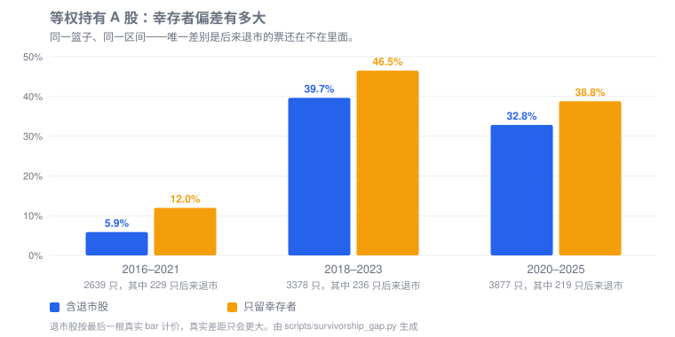

<section class="cne-hero">
  

    
OPEN · SELF-HOSTED · POINT-IN-TIME

    <h1>把分散的 A 股数据， 变成自己的研究底座</h1>
    
CNEquity 将多源行情、基本面、事件与宏观数据持续落到本地 Parquet，统一处理复权、历史 Universe 和 PIT，让每一次研究都可回查、可续跑、可解释。

    

      <a class="cne-button cne-button--primary" href="getting-started/quickstart/">一分钟开始</a>
      <a class="cne-button cne-button--secondary" href="datasets/catalog/">浏览 42 个数据集</a>
    

    

      <strong>零注册</strong> 无 API Token
      <strong>开放格式</strong> Parquet
      <strong>行级溯源</strong> source / version / time
    

  

  

    

      
      <b>CNEquity · illustrative flow</b>
    

    

      
<i>$</i> pip install cnequity

      
<i>$</i> cne demo

      
 TDX connection OK

      

        instrumentscurated<strong>5 rows</strong>
        daily_barscurated<strong>150 rows</strong>
        qualityaudit<strong>PASS</strong>
      

      
✓ Local lake ready · 5 symbols · 30 sessions

    

  

</section>

<section class="cne-strip" aria-label="项目规模">
  
<strong>42</strong>注册数据集

  
<strong>39 + 3</strong>Curated + Derived

  
<strong>3</strong>Python · DuckDB · Polars

  
<strong>1</strong>日更命令

</section>

<section class="cne-section cne-section--intro">
  
WHY CNEQUITY

  <h2>不是再包一层取数接口， 而是把研究口径放进数据层</h2>
  

    <article>
      01
      <h3>历史不会悄悄改变</h3>
      
退市股、历史成分和 PIT 进入统一查询合同，避免用今天的股票名单解释过去。

      <a href="recipes/pit-rebalance/">查看 PIT Recipe →</a>
    </article>
    <article>
      02
      <h3>每一行都能追到来源</h3>
      
所有 curated 行保留来源、数据版本和采集时间；结果出现差异时，有证据可查。

      <a href="datasets/contract/">查看数据合同 →</a>
    </article>
    <article>
      03
      <h3>数据源故障不等于重来</h3>
      
分批写入、失败续跑、主备源与质量审计，让日更任务在真实网络环境里长期运行。

      <a href="operations/runbook/">查看运行手册 →</a>
    </article>
  

</section>

<section class="cne-section cne-evidence">
  

    
THE INVISIBLE ERROR

    <h2>同一个策略， 为什么收益会翻倍？</h2>
    
只使用今天仍然上市的股票回看 2016–2021 年，同一等权买入持有策略的收益从 <strong>5.9%</strong> 变成 <strong>12.0%</strong>。那些退市股票并非收益为零，而是根本没有进入计算。

    <a class="cne-text-link" href="recipes/research-baseline/">了解可复查的研究基线 →</a>
  

  

    
  

</section>

<section class="cne-section">
  
CHOOSE YOUR PATH

  <h2>从一次成功查询开始</h2>
  

    <article>
      01 · TRY
      <h3>一分钟试玩</h3>
      
拉取 5 只股票最近约 30 个交易日的真数据；网络受限时可用确定性离线样例验证完整链路。

      <pre><code>pip install cnequity
cne demo</code></pre>
      <a href="getting-started/quickstart/">打开快速开始 →</a>
    </article>
    <article>
      02 · BUILD
      <h3>建立全市场数据湖</h3>
      
默认覆盖全市场最近三年，之后每天只需一条命令增量更新；中断后可从失败批次续跑。

      <pre><code>cne config init
cne init
cne run daily</code></pre>
      <a href="operations/runbook/">查看生产运行方式 →</a>
    </article>
    <article>
      03 · QUERY
      <h3>接入研究与 AI Agent</h3>
      
同一份开放数据可被 Python、DuckDB、Polars 或只读 MCP 使用，采集与消费彼此独立。

      <pre><code>from cnequity.query import load
bars = load("daily_bars")</code></pre>
      <a href="reference/mcp/">查看 MCP 接入 →</a>
    </article>
  

</section>

<section class="cne-section cne-datasets">
  

    
DATA COVERAGE

    <h2>从市场参考到风险事件， 保持一套查询契约</h2>
  

  

    <a href="datasets/catalog/#l0">证券主数据</a>
    <a href="datasets/catalog/#l1">日线与分钟线</a>
    <a href="datasets/catalog/#l2">公告与公司行为</a>
    <a href="datasets/catalog/#l3">财报与估值</a>
    <a href="datasets/catalog/#l4">资金与龙虎榜</a>
    <a href="datasets/catalog/#l5">指数与行业成分</a>
    <a href="datasets/catalog/#l6">宏观与市场宽度</a>
    <a href="datasets/catalog/#l7">新闻与情绪</a>
    <a href="datasets/catalog/#l8">解禁与监管事件</a>
  

</section>

<section class="cne-cta">
  

    
YOUR DATA, YOUR HISTORY

    <h2>让下一次研究，从可信的数据底座开始。</h2>
  

  

    <a class="cne-button cne-button--primary" href="getting-started/installation/">开始安装</a>
    <a class="cne-button cne-button--secondary" href="https://github.com/rootSunc/cnequity">GitHub 仓库</a>
  

</section>

